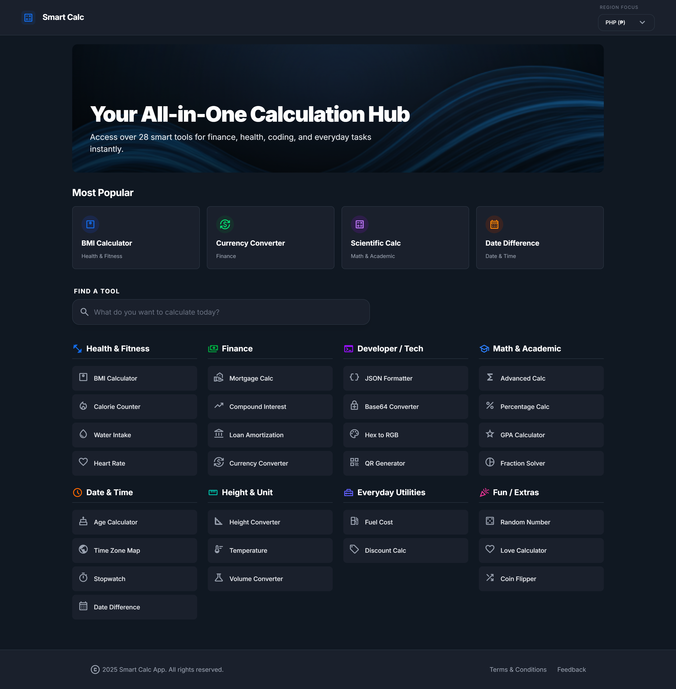

# Smart Calculators



A comprehensive suite of modern, responsive, and easy-to-use calculators built with performance and aesthetics in mind. Whether you need to calculate your mortgage payments, convert temperatures, or check your BMI, Smart Calculators has you covered.

## 🚀 Features

### 💰 Finance

- **Mortgage Calculator**: Estimate monthly payments with home price, down payment, and interest rates.
- **Loan Amortization**: Detailed repayment schedules with principal/interest breakdown.
- **Compound Interest**: Visualize how your investments grow over time.
- **Currency Converter**: Real-time conversion between major global currencies.
- **Fuel Cost & Discount Calculators**: Quick utilities for everyday spending.

### 📐 Math

- **Advanced Scientific Calculator**: Standard operations plus advanced functions.
- **GPA Calculator**: Track your academic performance.
- **Percentage**: Easy tools for "X is what % of Y" and more.

### ❤️ Health

- **BMI Calculator**: Check your Body Mass Index with visual categories.
- **Calorie Counter (TDEE)**: Estimate daily calorie needs based on activity levels.
- **Body Fat & Heart Rate**: Essential health metrics at a glance.

### 🛠️ Developer & Utilities

- **Unit Converters**: Temperature, Volume, Length, and more.
- **Developer Tools**: JSON Formatter, Base64 Encoder/Decoder, QR Code Generator, Color Converter.

## 🛠️ Tech Stack

Built with a modern, high-performance web stack:

- **[SolidJS](https://www.solidjs.com/)**: Reactive library for building user interfaces without a virtual DOM.
- **[Tailwind CSS v4](https://tailwindcss.com/)**: Utility-first CSS framework for rapid UI development.
- **[Vite](https://vitejs.dev/)**: Next-generation frontend tooling.
- **[KaTeX](https://katex.org/)**: Fast math typesetting for formula rendering.

## 💻 Getting Started

To run this project locally:

1.  **Clone the repository:**

    ```bash
    git clone https://github.com/adam-ctrlc/smart-calculator.git
    cd smart-calculators
    ```

2.  **Install dependencies:**

    ```bash
    npm install
    ```

3.  **Run the development server:**

    ```bash
    npm run dev
    ```

4.  Open `http://localhost:5173` in your browser.

## 🎨 Design System

The application features a premium dark-themed UI with:

- **Global State Management**: Dedicated stores for user preferences like currency.
- **Responsive Layouts**: Optimized for mobile, tablet, and desktop.
- **Accessible Components**: Custom input and select components built with accessibility in mind.
